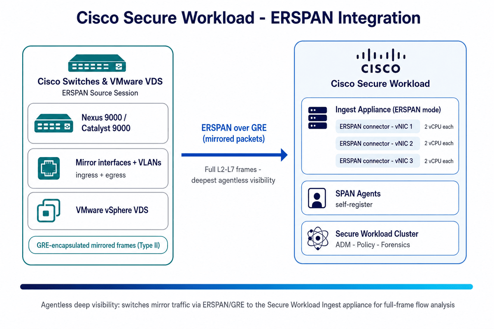

# Cisco Secure Workload → ERSPAN Integration Guide

A step-by-step integration guide for the **richest agentless visibility** in Cisco Secure Workload (CSW): mirroring switch traffic via **ERSPAN** (Encapsulated Remote Switch Port Analyzer) — GRE-encapsulated frames — to the **ERSPAN connectors** on a CSW **Ingest appliance**. Ideal for legacy servers, mainframes, OT/IoT, and VMware VDS workloads that can't run an agent.

> **⚠ Disclaimer:** This is a **community reference guide** prepared by Cisco Solutions Engineering — not an official Cisco product document. Always refer to the [official Cisco Secure Workload documentation](https://www.cisco.com/c/en/us/support/security/tetration/series.html) and the [Compatibility Matrix](https://www.cisco.com/c/m/en_us/products/security/secure-workload-compatibility-matrix.html) for authoritative, up-to-date guidance.

---

## What This Covers

| Area | Detail |
|---|---|
| **Integration type** | **Agentless** packet mirroring — **ERSPAN connectors** run on a CSW **Ingest appliance** (ERSPAN mode) |
| **Sources** | Cisco **Nexus 9000 / Catalyst 9000 / ASR** and **VMware vSphere VDS** (Remote Mirroring Source) |
| **Transport** | **ERSPAN over GRE** (IP-encapsulated mirrored frames) — requires L3 reachability |
| **ERSPAN types** | **Type I / II / III** (+ VMware VDS format); **Type II** is the typical default |
| **Appliance** | Same OVA/QCOW2 as standard Ingest; runs **3 ERSPAN connectors** internally, each with a **dedicated vNIC** + **2 vCPUs** |
| **Registration** | SPAN agents **self-register** — no extra CSW UI connector config |
| **Enforcement** | **None** — deep flow **visibility only**; no host/process metadata, no policy push |
| **Verified against** | CSW 4.x on-prem and SaaS |

---

## Quick Start

### Prerequisites
- A Cisco switch/router supporting ERSPAN (Nexus 9000, Catalyst 9000, ASR) or **VMware VDS**
- **L3 reachability** from the switch to the Ingest appliance vNIC IP (ERSPAN is GRE/IP-encapsulated)
- A free **ERSPAN source session** on the switch (sessions are limited per platform)
- A CSW **Ingest appliance deployed in ERSPAN mode** (6+ vCPUs, 3 vNICs), registered with the cluster
- Sufficient path bandwidth for the mirrored traffic volume; GRE not blocked on the path

### Steps (summary)

**On the Cisco switch (Nexus example):**
1. `monitor session 10 type erspan-source`
2. `source interface Ethernet1/23 both` and/or `source vlan 315,512`
3. `destination ip <Ingest vNIC IP>`, `erspan-id 10`, `origin ip <switch L3 IP>`, `no shut`
4. Verify: `show monitor session 10` → State **up**

**On Cisco Secure Workload:**
1. Deploy the Ingest OVA/QCOW2 and select **ERSPAN mode**; assign 3 vNIC IPs (one per container)
2. Match each ERSPAN session **destination IP** to a container's **vNIC IP**
3. The 3 **SPAN agents self-register** — confirm in **Manage → Virtual Appliances / Agents**

**Verify:**
1. `Manage → Agents` → filter **SPAN Agent** → **Active**
2. `Observe → Traffic` — flows appear for the mirrored VLAN/subnet
3. Watch the **Agent Packet Misses** graph — should be near 0

See the [full step-by-step guide](CSW-ERSPAN-Integration-Guide.md) or [open the HTML version](CSW-ERSPAN-Integration-Guide.html) for detailed instructions (Nexus, IOS-XE, and VMware VDS configs).

---

## Video References

> **Legend:** 🎬 video · 📘 guide · 📄 doc

| Reference | What it shows |
|---|---|
| [🎬 CSW User Education video library](https://github.com/chandrapati/CSW-User-Education) | Curated Secure Workload concept explainers and walkthroughs |
| [📘 ERSPAN Integration Guide](CSW-ERSPAN-Integration-Guide.md) | This repo's full step-by-step deployment guide |
| [📄 Cisco docs — ERSPAN Connector](https://www.cisco.com/c/en/us/td/docs/security/workload_security/secure_workload/user-guide/4_0/cisco-secure-workload-user-guide-on-prem-v40/configure-and-manage-connectors-for-secure-workload.html) | Authoritative connector behavior, appliance sizing, and limits |

---

## Architecture Diagram

*Cisco switches (and VMware VDS) mirror selected interfaces/VLANs and send GRE-encapsulated ERSPAN frames to the ERSPAN connectors on a CSW Ingest appliance; each of the three SPAN agents processes full L2–L7 frames and forwards flow observations to the cluster for ADM, policy, and forensics.*

---

## Files in This Repo

| File | Description |
|---|---|
| [`README.md`](README.md) | This file — quick start and overview |
| [`CSW-ERSPAN-Integration-Guide.md`](CSW-ERSPAN-Integration-Guide.md) | Full step-by-step guide (Markdown source) |
| [`CSW-ERSPAN-Integration-Guide.html`](CSW-ERSPAN-Integration-Guide.html) | Styled HTML — open in browser for best experience |
| [`csw-erspan-architecture.png`](csw-erspan-architecture.png) | Architecture diagram |
| [`build.sh`](build.sh) | Regenerate HTML from Markdown (requires pandoc) |

---

## When to Use ERSPAN — Quick Reference

| Method | Visibility | Deployment |
|---|---|---|
| **CSW Agent** | Deepest (process, user, socket) | Agent on each host |
| **ERSPAN** | Rich (full L2–L7 frames) | Switch config + Ingest VM (ERSPAN mode) |
| **NetFlow** | Moderate (flow summaries) | Switch config + Ingest VM |

| Metric | Limit |
|---|---|
| ERSPAN connectors per Ingest appliance | **3** (one per container/vNIC) |
| vCPUs per ERSPAN container | 2 (dedicated) |
| ERSPAN types | Type I, II, III + VMware VDS |
| SPAN sessions per switch | Platform-dependent (typically 4–8) |

> **Important:** ERSPAN provides **flow/packet visibility only** — no process/host metadata and no enforcement. Be selective about mirrored interfaces/VLANs (use ERSPAN filter ACLs) and set **MTU** to absorb the ~160-byte ERSPAN overhead (e.g. `mtu 1464`). If **Packet Misses** rise, reduce source scope or add another ERSPAN Ingest appliance.

---

## Step-by-Step Guides

> **Legend:** 🎬 video · 📘 guide · 📄 doc

Hands-on integration and deployment guides — follow these top to bottom to build out a deployment:

| Guide | Description | Best for |
|-------|-------------|---------|
| [📘 Agent Installation](https://github.com/chandrapati/CSW-Agent-Installation-Guide) | Deploy CSW agents on Linux / Windows / cloud | Day-1 sensor deployment |
| [📘 Policy Lifecycle](https://github.com/chandrapati/CSW-Policy-Lifecycle) | Policy discovery → enforcement workflow | Policy management |
| [📘 ISE / pxGrid](https://github.com/chandrapati/csw-ise-integration) | ISE/pxGrid: user-identity–aware microsegmentation | Identity & Zero Trust |
| [📘 AnyConnect NVM](https://github.com/chandrapati/csw-anyconnect-nvm) | Endpoint process flows + user identity via NVM | Endpoint telemetry |
| [📘 ServiceNow CMDB](https://github.com/chandrapati/csw-servicenow-integration) | ServiceNow CMDB label enrichment for workload scopes | CMDB-driven policy |
| [📘 Infoblox](https://github.com/chandrapati/csw-infoblox-integration) | Infoblox IPAM/DNS extensible-attribute label enrichment | IPAM/DNS-driven policy |
| [📘 F5 BIG-IP](https://github.com/chandrapati/csw-f5-integration) | F5 virtual-server labels, policy enforcement, IPFIX flow visibility | Load balancer segmentation |
| [📘 NetScaler ADC](https://github.com/chandrapati/csw-netscaler-integration) | NetScaler LB virtual-server labels, ACL enforcement + AppFlow/IPFIX flow visibility | Load balancer segmentation |
| [📘 AWS Connector](https://github.com/chandrapati/csw-aws-connector) | EC2 tag ingestion + VPC flow logs + Security Group enforcement | AWS workloads |
| [📘 Azure Connector](https://github.com/chandrapati/csw-azure-connector) | Azure VM tag ingestion + VNet flow logs + NSG enforcement | Azure workloads |
| [📘 GCP Connector](https://github.com/chandrapati/csw-gcp-connector) | GCE label ingestion + VPC flow logs + firewall enforcement | GCP workloads |
| [📘 NetFlow](https://github.com/chandrapati/csw-netflow-integration) | NetFlow v9/IPFIX agentless flow ingestion from switches | Network fabric visibility |
| [📘 ERSPAN](https://github.com/chandrapati/csw-erspan-integration) | Agentless packet mirroring for legacy / OT / IoT devices | Deep agentless visibility |
| [📘 Secure Firewall](https://github.com/chandrapati/CSW-Secure-Firewall-Integration-Guide) | NSEL flow ingestion from Cisco Secure Firewall (FTD/ASA) | Firewall flow visibility |
| [📘 Splunk Integration](https://github.com/chandrapati/csw-splunk-integration) | CSW syslog alerts → Splunk SIEM | SecOps / SIEM teams |

## Resources

> **Legend:** 🎬 video · 📘 guide · 📄 doc

Learning paths, reference material, and day-2 tooling:

| Resource | Description | Best for |
|----------|-------------|---------|
| [📘 User Education](https://github.com/chandrapati/CSW-User-Education) | Onboarding guides, concept explainers, and curated video library | New CSW users |
| [📘 Compliance Mapping](https://github.com/chandrapati/CSW-Compliance-Mapping) | Map CSW controls to NIST, PCI-DSS, HIPAA, CIS | Compliance & audit |
| [📘 Tenant Insights](https://github.com/chandrapati/CSW-Tenant-Insights) | Tenant-level reporting and analytics | Visibility metrics |
| [📘 Operations Toolkit](https://github.com/chandrapati/CSW-Operations-Toolkit) | Day-2 ops scripts: health checks, reporting, policy analysis | Ongoing operations |
| [📄 Supported OS & Compatibility Matrix](https://www.cisco.com/c/m/en_us/products/security/secure-workload-compatibility-matrix.html) | Cisco's authoritative list of supported agent operating systems, external systems, and connector requirements | Platform planning & prerequisites |

> **Suggested customer journey:**
> User Education → Agent Installation → Policy Lifecycle → ISE/pxGrid → ServiceNow CMDB → Infoblox → F5 BIG-IP → NetScaler ADC → Splunk Integration → Compliance Mapping → Operations Toolkit
